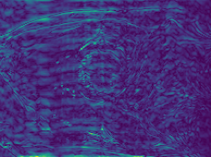
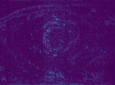

# End2End-DLMRI

Here, we provide an implementation of the network described in our work

"Deep Supervised Dictionary Learning by Algorithm Unrolling - Application to Fast 2D Dynamic MR Image Reconstruction"

by A. Kofler, M.C. Pali, T. Schaeffter and C. Kolbitsch.

The method is a so-called physics-informed neural network that implements an algorithm that approaches the solution of the problem

by alternating minimization. The weights of the network - i.e. the atoms of the dictionary and the regularization parameters  and  - can be trained in a supervised and physics-informed way.

## Code

By running the files dlmri_reco_example.py and dlmri_denoising_example.py you can get familiar with how to apply the networks to an undersampled MRI reconstruction problem and a image denoising problem.

## Results

The main results of the paper are the following:

First, we have observed that reconstructing images with the dictionary obtained by training it via algorithm unrolling yields superior results compared to the dictionary obtained by decoupled pre-training, i.e. using the LASSO algorithm to solve a sparse approximation problem to obtain the dictionary.

Second, we have introduced a 2D spatio-temporal dictionary that yields superior results compared to the standard choice of the 3D dictionary.

The following shows a comparison of an image obtained using the 3D dictionary pre-trained by employing the LASSO algorithm and an image obtained with the proposed 2D spatio-temporal dictionary that was trained usin by algorithm unrolling, both results are shown for a dictionary of shape  with .

From left to right:

Zero-Filled Recon - 3D dictionary with patch-size (4,4,6) - 2D dictionary with shape (4,1,16) - Target image, for .

   
  

The following shows the decay of the mean squared error (MSE) over 16 iterations that were used reconstruct the images shown above.

## Paper

The paper (open-access) is available under

<https://aapm.onlinelibrary.wiley.com/doi/10.1002/mp.16182>

## Citing this work

For citing this work, please use

@article{kofler2023end2end_dlmri,
  title={Deep supervised dictionary learning by algorithm unrolling—Application to fast 2D dynamic {MR} image reconstruction},
  author={Kofler, Andreas and Pali, Marie-Christine and Schaeffter, Tobias and Kolbitsch, Christoph},
  journal={Medical Physics},
  volume={50},
  number={5},
  pages={2939--2960},
  year={2023},
  publisher={Wiley Online Library}
}
